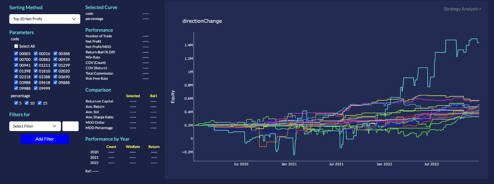
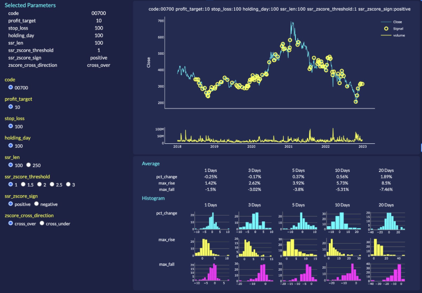

# Plotguy

**Version:** 1.2.7

Plotguy is a Python visualization library designed to help users compare, evaluate, and analyze trading strategies with minimal coding effort. It integrates seamlessly with **HKFDB (Hong Kong Finance Database)**, which provides cleaned daily financial data for the Hong Kong market.

Plotguy is ideal for users with basic Python knowledge who want to perform backtesting and strategy analysis without spending significant time writing their own backtest code.

---

## Overview

HKFDB (Hong Kong Finance Database) offers cleaned daily financial data for the Hong Kong market. Plotguy builds on top of this data by providing an interactive graphical interface for comparing investment strategy performance.

With Plotguy, users can easily compare multiple signal strategies across different stocks, rank them using common performance metrics, and visually analyze their results.

---

## Features

### Strategy Comparison Interface

- Provides a graphical interface to compare different signal strategies across different stocks
- Automatically sorts and ranks strategies based on selected metrics, such as:
  - Top 20 Net Profit
  - Top 20 Sharpe Ratio
- Plots the selected strategies’ equity curves on a single chart for easy comparison

---

### Performance Metrics Dashboard

When an equity curve is selected, Plotguy displays a detailed performance matrix including:

- Number of trades  
- Net profit  
- Maximum drawdown (MDD)  
- Net Profit / MDD  
- Win rate  
- Annualized return  
- Performance by year  
- Comparison with Buy & Hold on the same underlying asset  

---

### Analysis Mode

For deeper investigation of a specific strategy, users can switch to **Analysis Mode**, where:

- Daily close prices of the underlying asset are displayed
- Trading volume is shown on the same chart
- Signal execution times are marked with circles on the chart

This mode allows users to visually inspect signal timing and market behavior in detail.

---

## Why Plotguy?

- Designed for users with basic Python knowledge
- Greatly reduces the time required to build and test trading strategies
- Eliminates the need to write complex backtesting code from scratch
- Provides clear, visual comparisons of strategy performance
- Integrates naturally with HKFDB financial data

---

## Screenshots




---

## Installation

```bash
pip install plotguy
